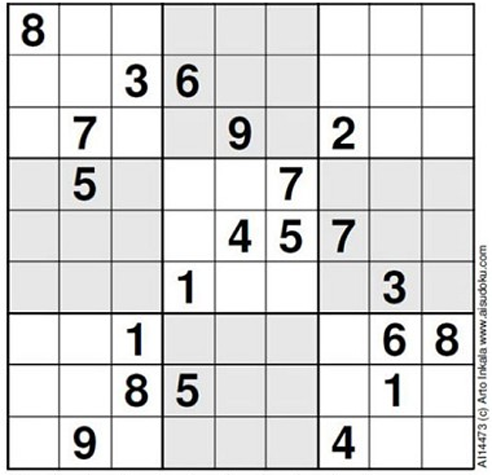

# Super Sudoku

This project solves multiple types of common variant or standard sudoku puzzles.
There are multiple sample puzzles that can be solved included in this repo [here](./Sample%20Puzzles).
You can input a custom puzzle, as long as you can represent the puzzle constraints with the supported [rules](#rule-Types).

## Inputting Puzzles

This application takes .json files as input.The input is assumed to be correct,
so if a file is missing any expected data or is not structured correctly, it may die ungracefully.
Extra fields will be ignored. See the sample puzzles for examples.

### Common Structures

These structures are commonly used when creating puzzle files.

#### Cell

Whenever a specific cell location needs to be refrenced, it is done as an array of 2 numbers representing the row and column of the cell.
For example, the cell at row 3 column 7 is represented as `[ 3, 7 ]` in the puzzle file. This is relevent for some of the [rules](#rule-types).

#### Grid Array

Sometimes it is usefull to give some puzzle input as a 2D grid that represents the puzzle grid itself.
This is done as an array of [size](#size) strings, and each string should be [size](#size) characters long.
Think of the grid of characters as the sudoku grid itself. So the fourth character of the second string would correspond to the cell at row 2 column 4.
See the section on [given digits](#given-digits) for an example.

### Puzzle Structure

The root JSON object has these fields:
- [Name](#name-and-author) (Optional)
- [Author](#name-and-author) (Optional)
- [Size](#size)
- [GivenDigits](#given-digits)
- [Rules](#rules)

#### Name and Author
Currently these fields are not used for anything, but I like to have them as a credit of who created the puzzle.

#### Size

The dimensions of the puzzle given as an integer. Essentially the number of cells in a row/column. Puzzles are assumed to be square.
For standard sudoku puzzles, this is always 9. Currently it is not possible to input puzzles with a size greater than 9.

#### Given Digits

The starting state of the puzzle. This is given as a [grid array](#grid-array).
Place digits between 1 and the puzzle's [size](#size), and use `.` (period) for cells that are empty.
Here's an example ([World's Hardest Sudoku](https://www.conceptispuzzles.com/index.aspx?uri=info/article/424)):



```json
"GivenDigits": [
    "8........",
    "..36.....",
    ".7..9.2..",
    ".5...7...",
    "....457..",
    "...1...3.",
    "..1....68",
    "..85..1..",
    ".9...4..."
  ]
```
  
#### Rules
  
These are all the rules for the puzzle. They are given as an array of objects that contain the rule name and any additional information (if required)
used to set up the rule. These vary between rules, so see the section on rules (TODO) for specific structure.  
Currently supported rules are:
- [Standard](#standard)
- [Rows](#rows)
- [Columns](#columns)
- [Arrow](#arrow)
- [Thermo](#thermo)
- [Regions](#regions)
- [Diagonal](#diagonal)
- [Killer](#killer)
- [AntiKing](#antiking)
- [AntiKnight](#antiknight)
- [Disjoint](#disjoint)
- [Palindrome](#palindrome)
- [German Whispers](#german-whispers)
- [Renban](#renban)

## Rules Types

### Standard

These are the normal sudoku rules. This rule is what will prevent putting the same digits in a row, column or box*.
If this rule is present, then you should not specify the [rows](#rows) or [columns](#columns) rules.
The layout of the boxes is determined by the size of the puzzle and only common puzzle sizes (4, 6, and 9) are supported.
If using an uncommon puzzle size, boxes will just not be used. It is possible to use the [Regions](#Regions) rule to define custom box shapes.

[Example](./Sample%20Puzzles/hardSudoku.json)

### Rows

This restricts each row of the puzzle to have only one of each digit. Do not use this rule if you are using the [standard](#standard) rule.

[Example](./Sample%20Puzzles/hardSudoku.json)

### Columns

This restricts each column of the puzzle to have only one of each digit. Do not use this rule if you are using the [standard](#standard) rule.

[Example](./Sample%20Puzzles/hardSudoku.json)

### Arrow

This rule requires a group of cells to sum up to the value of another cell.
This situation is like that found in [arrow sudoku](https://masteringsudoku.com/arrow-sudoku/).
This rule contains a _Data_ field which is an array of objects that each represent a seperate arrow.
Each arrow object contains _Sum_ and _Arrow_. The _Sum_ is the [cell](#cell) that contains the circle or base of the arrow.
The _Arrow_ is an array of [cells](#cell) that are the body of the arrow.
The sum of all the values of the cells in the _Arrow_ is equal to the value of the _Sum_ cell.

[Example](./Sample%20Puzzles/arrow.json)


### Thermo

This rule requires that a sequence of cells increases. This is common in [thermo sudoku](https://masteringsudoku.com/thermo-sudoku/).
This rule contains a _Data_ field which is an array of objects that each represent a seperate thermo.
Each thermo object has a single _Thermo_ field which is an array of the [cells](#cell) that make up the themo.
The order of the array matters, as the first element is the "bulb"(smallest value) and the last is the "tip" (greatest value).

[Example](./Sample%20Puzzles/thermo.json)

### Regions

This rule creates custom regions or boxes in the puzzle. Each region cannot contain any duplicated digits.
This is usefull to create jigsaw/irregular puzzles, as well as adding extra regions.
This rule contains a _Data_ field which is a [grid array](#grid-array).
Place characters to create regions in the grid. Any cell with the same characters are part of the same region.
Cells that have `.` are not added to any region.
If you have regions that overlap, you will need to create the regions rule multiple times.

[Example](./Sample%20Puzzles/regions.json)

### Diagonal

[Example](./Sample%20Puzzles/diagonal.json)

### Killer

[Example](./Sample%20Puzzles/killerCage.json)

### AntiKing

[Example](./Sample%20Puzzles/antiKing.json)

### AntiKnight

[Example](./Sample%20Puzzles/antiKnight.json)

### Disjoint

[Example](./Sample%20Puzzles/disjoint.json)

### Palindrome

[Example](./Sample%20Puzzles/palindrome.json)

### German Whispers

[Example](./Sample%20Puzzles/germanWhispers.json)

### Renban

[Example](./Sample%20Puzzles/renban.json)
